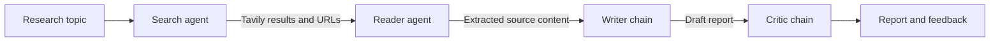

# LangChain Multi-AI Agent System

An AI-powered research assistant that turns a research topic into a structured report. It searches for relevant sources, extracts content from the most useful page, drafts a report, and reviews the result with a critic chain.

The project includes a Streamlit interface for interactive use and a Python pipeline for command-line or programmatic execution.

## Features

- Web search with Tavily
- Source reading and text extraction from public web pages
- Structured report generation with citations and key findings
- Automated critic feedback for each generated report
- Interactive Streamlit dashboard with intermediate results
- Downloadable plain-text reports

## Architecture

The application follows a sequential four-stage pipeline:



1. **Search agent** uses a LangChain tool backed by Tavily to find recent sources.
2. **Reader agent** selects a relevant URL and calls the scraper tool.
3. **Writer chain** combines search results and extracted content into a structured report.
4. **Critic chain** evaluates the report and returns strengths, improvements, and a verdict.

The Streamlit app stores the intermediate values in a state dictionary so users can inspect sources, extracted research, the report, and critic feedback separately.

## Technology Stack

- **Python 3.11+**: application language
- **Streamlit**: web interface
- **LangChain, LangChain Core, LangChain Community**: agents, prompts, and runnable chains
- **LangChain Groq**: Groq chat model integration
- **Groq**: language model provider (`openai/gpt-oss-20b`)
- **Tavily**: web search API
- **Requests**: HTTP requests for source pages
- **Trafilatura, readability-lxml, BeautifulSoup, and lxml**: web-page content extraction and cleanup
- **python-dotenv**: loading local environment variables
- **Rich**: terminal output formatting

## Project Structure

```text
.
├── app.py                    # Streamlit application
├── main.py                   # Example programmatic/CLI entry point
├── requirements.txt          # Python dependencies
└── src/
	├── agents/agents.py      # Search/reader agents and writer/critic chains
	├── pipelines/pipeline.py # Sequential research pipeline
	└── tools/tools.py        # Tavily search and web scraping tools
```

## Installation

### 1. Clone the repository

```bash
git clone https://github.com/<your-username>/LangChain-Multi-AI-Agent-System.git
cd LangChain-Multi-AI-Agent-System
```

### 2. Create and activate a virtual environment

Using Conda:

```bash
conda create -n langagent python=3.11 -y
conda activate langagent
```

Or using Python's built-in virtual environment:

```bash
python -m venv .venv
```

Windows PowerShell:

```powershell
.\.venv\Scripts\Activate.ps1
```

macOS/Linux:

```bash
source .venv/bin/activate
```

### 3. Install dependencies

```bash
python -m pip install --upgrade pip
pip install -r requirements.txt
```

### 4. Configure API keys

Create a `.env` file in the project root:

```env
GROQ_API_KEY=your_groq_api_key
TAVILY_API_KEY=your_tavily_api_key
```

Get credentials from [Groq](https://console.groq.com/keys) and [Tavily](https://app.tavily.com/). Keep `.env` private and do not commit it to source control.

## Usage

### Streamlit interface

```bash
streamlit run app.py
```

Open the local URL shown by Streamlit, enter a topic, and select **Start Research**. The dashboard exposes four result tabs: sources, detailed research, the generated report, and critic feedback.

### Python pipeline

The example entry point runs a fixed topic:

```bash
python main.py
```

To use the pipeline from another Python module:

```python
from src.pipelines.pipeline import run_research_pipeline

result = run_research_pipeline("The impact of AI on the job market")
print(result["report"])
print(result["feedback"])
```

## Configuration Notes

- The model is configured in `src/agents/agents.py` through `ChatGroq`.
- The Streamlit sidebar controls the maximum search context passed to the reader agent.
- Source pages must be reachable over the network and may refuse automated requests.
- Generated reports are based on retrieved web content; review sources and claims before using them for publication or important decisions.

## Contributing

Contributions are welcome. Before opening a pull request:

1. Create a feature branch.
2. Keep changes focused and update the documentation when behavior changes.
3. Test the Streamlit flow and the Python pipeline with valid API keys.
4. Open a pull request describing the change and validation performed.

## License

This project is distributed under the license in [LICENSE](LICENSE).